# Task Tracker API 📝✅
A Task Tracker Backend System built using Node.js (Express JS) and Firestore Database.

## Importance of this System
This is a ready to use complete Backend System buil with Express JS that
runs within Node.js (as a runtime environment for JS Code).
This backend system is connected to a Jenkins (CI/CD tool) pipeline that
detects any changes within this GitHub Repository and triggers a pipeline
that test's this backend for any issues.
Upon successfull build of the system, the pipleine will save a 
Docker Image of the Backend System and will push a Containerized version 
of the Image up to the Docker Hub.

## Features
- Create Task's
- Get the list of all created Task's
- Mark Task's as completed
- Delete completed Task's
- Delete specific Task's

## Technologies
- Node.js
- Express JS 
- Jenkins 🏭⛓️🛠️
- Docker 🐋
- Firebase (Firestore Database) 🔥

## Screenshots

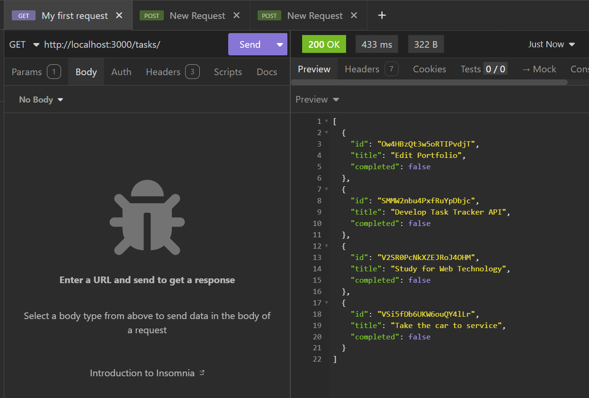

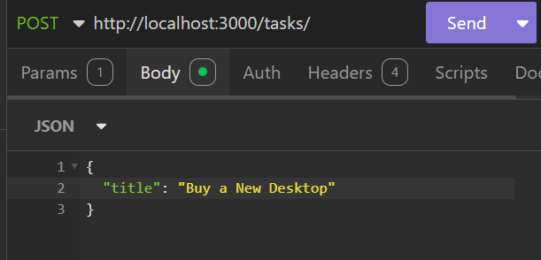

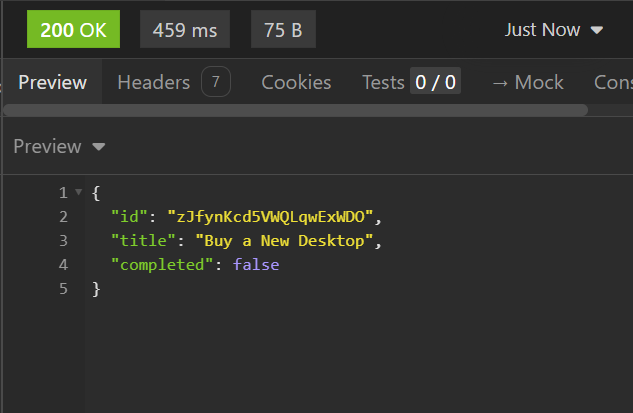

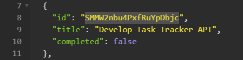

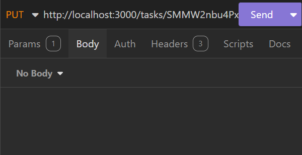

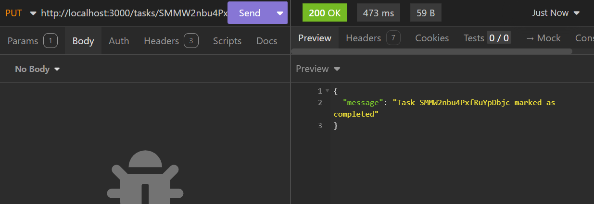

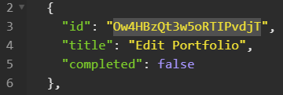

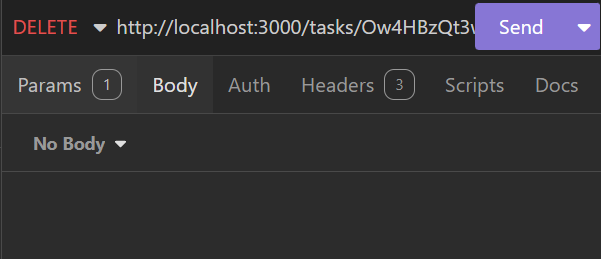

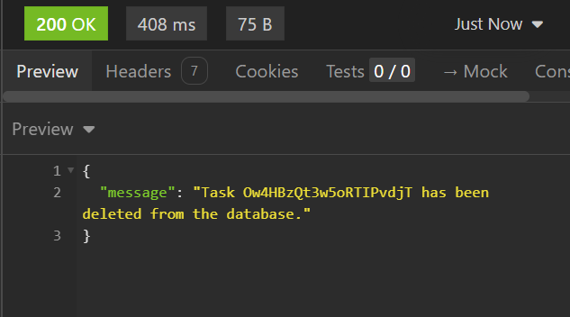

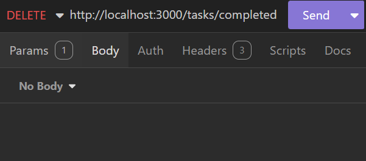

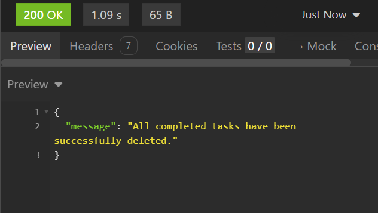

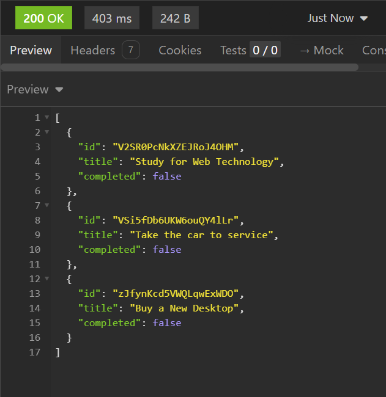

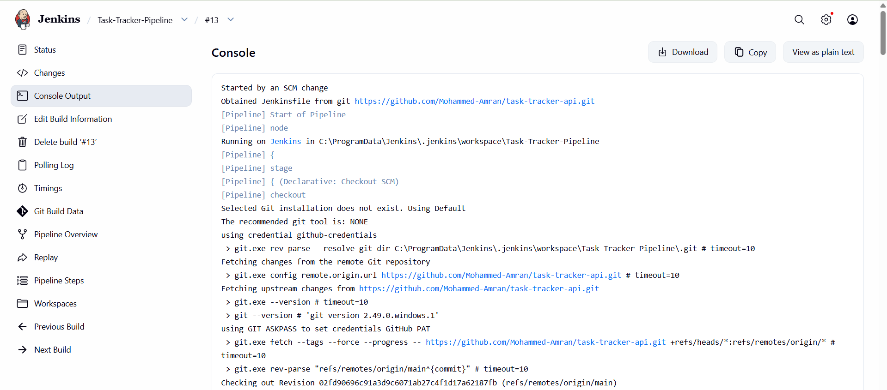

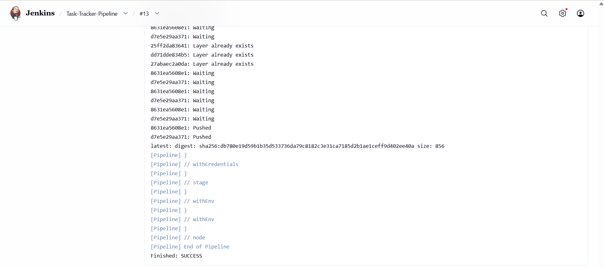

## How to Run the APP
1. Clone this project.
2. Run Docker Engine.
3. Run the command 'Node app.js' on the command line.
4. Use 'Insomnia'/Postman to test the API endpoints.
## Recommendation:
Feel free to create an Interactive Web UI or App for this Backend - and Contact Me! 😊
